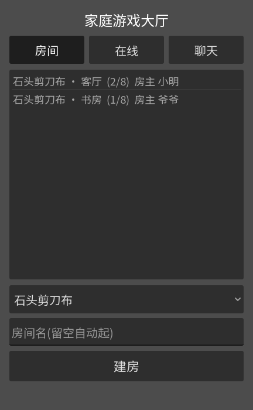

# godot-games

家庭游戏大厅:Godot 4 客户端 + 自托管 Nakama 权威服务端。
首个游戏是 N 人石头剪刀布淘汰赛,成语接龙(M4)在路上。

## 长什么样

| 大厅 | 对局中 |
|---|---|
|  |  |
|  |  |

## 怎么玩

1. 输入名字进大厅(支持中文,家里人重名会提示换一个)
2. 建房,或双击加入别人的房间
3. 全员点「准备」,房主点「开始游戏」
4. 每轮倒计时内出拳:布胜石头、剪刀胜布、石头胜剪刀。只出现两种手势时,
   赢的一边全部晋级、输的全部淘汰;三种都出现是平局重来 —— **连续平局时
   倒计时会越来越短**(条会变红),打到只剩一个人为止
5. 出局了留在观战席看完;局终重新准备就能再来一局

同机多开:桌面加 `--device-suffix=a/b/c`,浏览器标签加 `?player=a` ——
不加的话所有窗口会登进同一个账号。

## 仓库边界

这是**应用仓库**。它构建并发布版本化制品,不拥有任何部署环境的事实
(namespace、域名、密钥、资源限额都在部署仓库 homelab 里)。
两个仓库之间的全部交互面 = 两个 OCI 镜像 + 一份契约:
**[docs/deployment-contract.md](docs/deployment-contract.md)**。

| 制品 | 内容 |
|---|---|
| `ghcr.io/meirongdev/godot-games-nakama-modules` | 服务端 Lua 模块(initContainer 拷贝消费) |
| `ghcr.io/meirongdev/godot-games-web` | Godot Web 导出 + nginx |

## 本地开发

测试分 7 层(单测→解析→节点路径→e2e→截图→真玩→Web),见 **[docs/testing.md](docs/testing.md)**。速览:

```bash
cd nakama && docker compose up -d      # Nakama + Postgres
cd nakama && docker run --rm -v "$PWD:/work" -w /work imega/busted   # 82 项单测
python3 tools/e2e_match.py 3           # 三个真实账号打满一局
./tools/build_web.sh && python3 tools/serve_web.py   # http://localhost:8080/?player=a
                                       # serve_web.py 把 /v2/* 和 /ws 反代到 Nakama,
                                       # 拓扑与线上一致(见契约 §3.3.1)
```

Godot 编辑器打开 `godot/`,F5 即玩(连本地 compose)。

## 目录

```
godot/            Godot 4 客户端(ServerConnection 门面 + 场景)
nakama/modules/   服务端 Lua:rules/ 纯函数(全 TDD) + 适配层
nakama/spec/      busted 单测(跑在 Lua 5.1 容器里,对齐 GopherLua)
images/           发布制品的 Dockerfile
tools/            e2e 测试、构建、截图等工具
docs/             学习指南 / 设计 spec / 实现计划 / 部署契约
```

## 文档

- [nakama-godot-guide.md](docs/nakama-godot-guide.md) — Godot 4 接入 Nakama 完整指南
- [testing.md](docs/testing.md) — 本地测试分层与坑 · [最近一轮报告](docs/test-reports/2026-08-26.md)
- [deployment-contract.md](docs/deployment-contract.md) — 与部署仓库的契约(§3.3.1 是部署侧必须加的路由)
- [superpowers/specs/](docs/superpowers/specs/) · [superpowers/plans/](docs/superpowers/plans/) — 设计与实现记录
